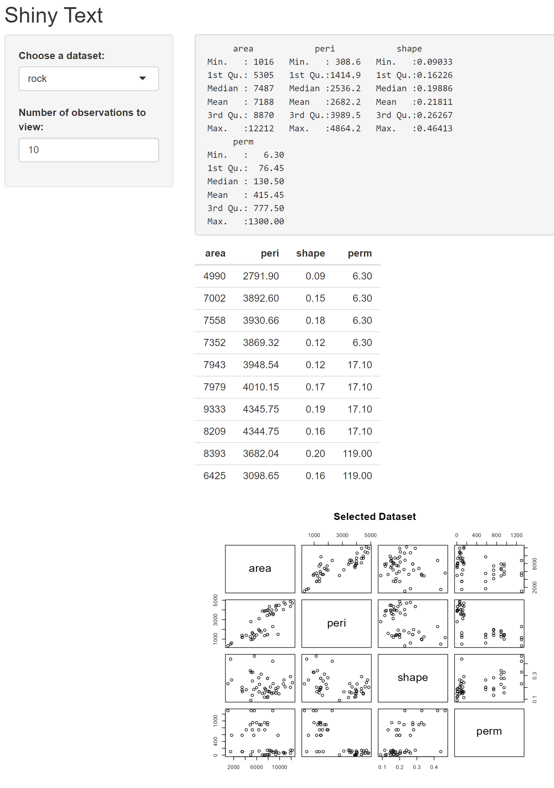

```{r setup, eval=FALSE}
library(shiny)

# Define UI for dataset viewer app
ui <- fluidPage(
  titlePanel("Shiny Text"),
  sidebarLayout(
    sidebarPanel(
      selectInput(inputId = "dataset",
                  label = "Choose a dataset:",
                  choices = c("rock", "pressure", "cars")),
      numericInput(inputId = "obs",
                   label = "Number of observations to view:",
                   value = 10)
    ),
    mainPanel(
      verbatimTextOutput("summary"),
      tableOutput("view"),
      plotOutput("scatterplot")
    )
  )
)

# Define server logic to summarize and view selected dataset
server <- function(input, output) {
  datasetInput <- reactive({
    switch(input$dataset,
           "rock" = rock,
           "pressure" = pressure,
           "cars" = cars)
  })

  output$summary <- renderPrint({
    dataset <- datasetInput()
    summary(dataset)
  })

  output$view <- renderTable({
    head(datasetInput(), n = input$obs)
  })

  # Additional scatterplot
  output$scatterplot <- renderPlot({
    dataset <- datasetInput()
    if (input$dataset == "cars") {
      plot(dataset$dist, dataset$speed, xlab = "Distance", ylab = "Speed", 
           main = "Scatterplot for Cars Dataset", pch = 19, cex = 1.5)
    } else {
      plot(dataset, main = "Selected Dataset", pch = 19, cex = 1.5)
    }
  }, height = 600)
}

shinyApp(ui = ui, server = server)
```

